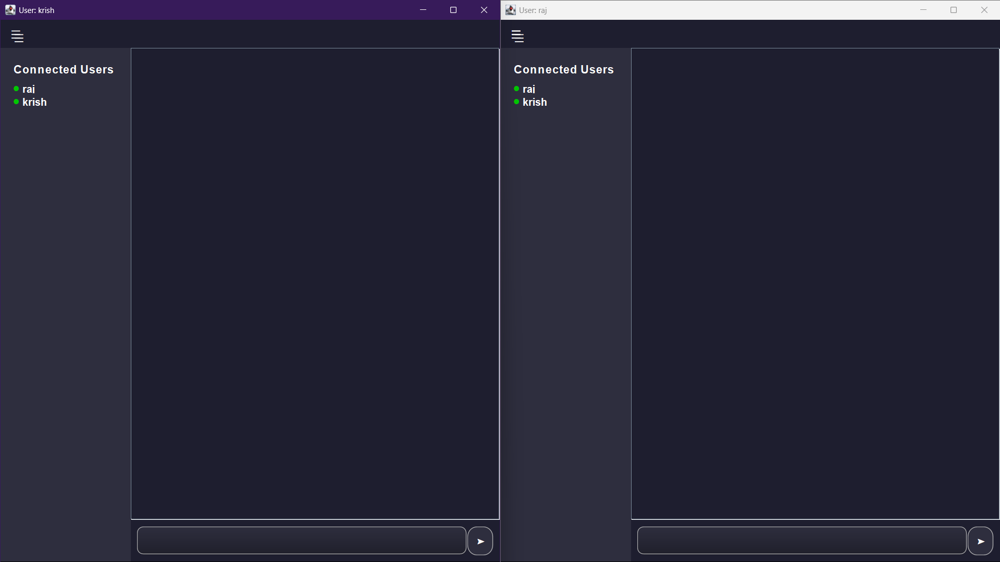
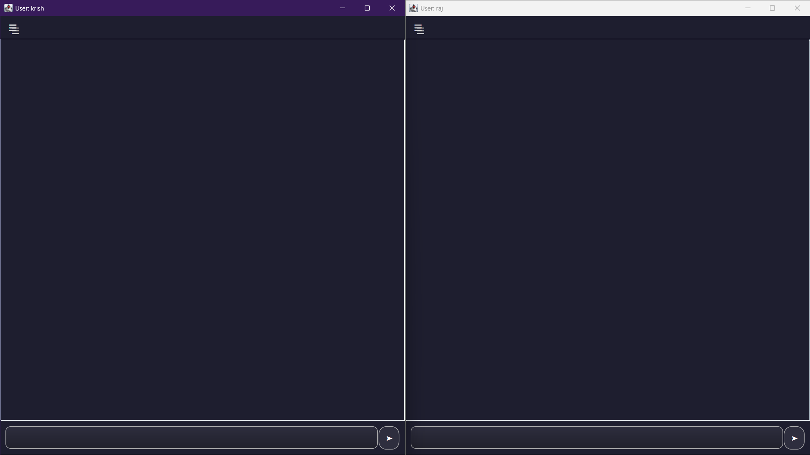
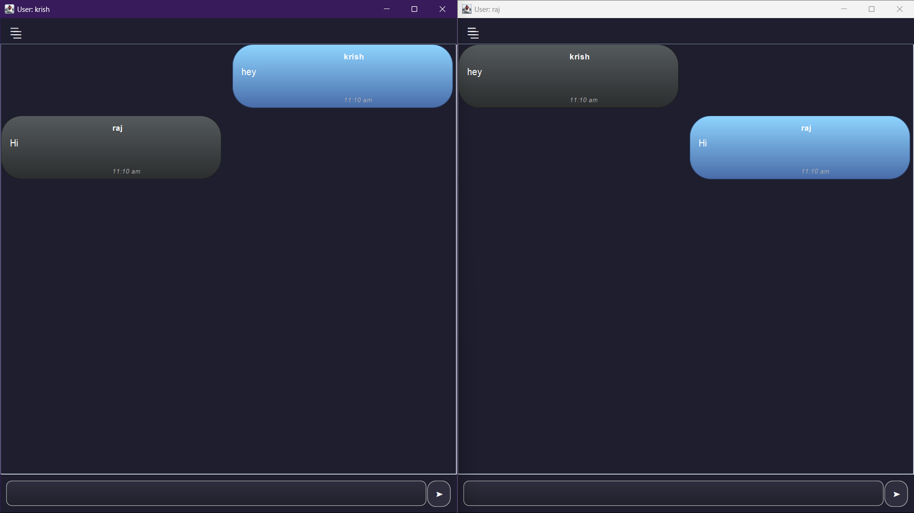
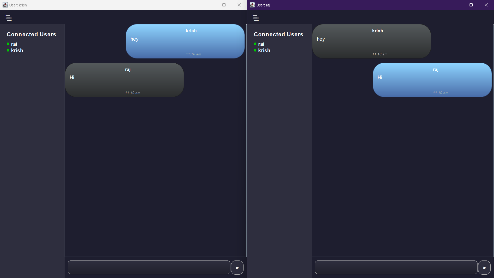

# 💬 Chat-App (Java Swing + WebSocket + STOMP)

A real-time chat application built using **Java Swing** for the GUI and **Spring Boot WebSockets (STOMP over SockJS)** for backend communication. Users can send and receive messages instantly, see who's online, and enjoy a sleek modern interface with rounded components and gradients.

---

## 🚀 Features

- 📡 Real-time messaging using STOMP over WebSocket
- 👤 Connected users sidebar with live updates
- 💬 Chat bubbles with rounded UI
- 🌙 Themed UI with modern custom components (`RoundedPanel`, `FancyTextField`, etc.)
- 📤 Message send button + Enter key support
- 🧠 Automatic scroll to latest message
- 🛑 Graceful disconnect handling
- 🖥️ Fully responsive resizing layout

---

## 🏗️ Technologies Used

### Frontend (Client - Java Swing):
- Java 17+
- Swing (`JFrame`, `JPanel`, custom painting)
- `javax.websocket` via Spring’s STOMP client
- Custom components:
  - `FancyTextField`
  - `RoundedPanel`
  - `RoundedButtonFactory`

### Backend (Server - Spring Boot):
- Spring Boot
- WebSocket + STOMP (`spring-websocket`)
- SockJS fallback support
- Jackson for message serialization

---

### 🤝 Contributing :

- We welcome contributions from the community! If you'd like to help -  improve this project:

## 🖼️ UI Preview

<p align="center">
  
  
  
  
</p>

---

## 📂 Project Structure

```plaintext
Chat-App/
├── .gitignore
├── README.md
├── pom.xml (or build.gradle)
├── src/
│   └── main/
│       └── java/
│           └── com/
│               └── example/
│                   └── demo/
│                       ├── client/
│                       │   ├── ClientGUI.java
│                       │   ├── ClientController.java
│                       │   └── component/
│                       │       ├── FancyTextField.java
│                       │       ├── RoundedPanel.java
│                       │       └── RoundedButtonFactory.java
│                       ├── session/
│                       │   └── MessageListener.java
│                       ├── model/
│                       │   └── Message.java
│                       └── ui/
│                           └── Utilities.java

---


